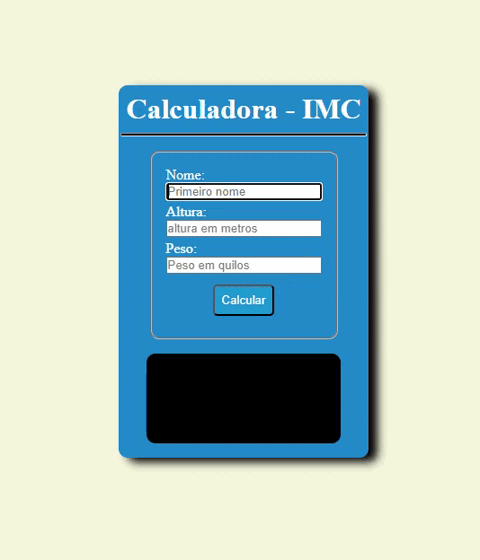
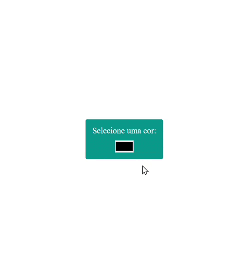
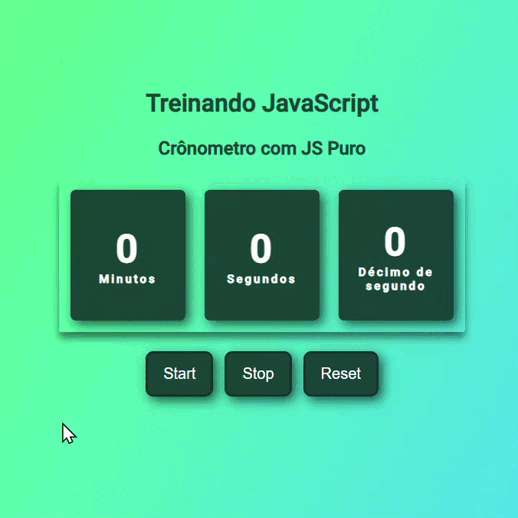
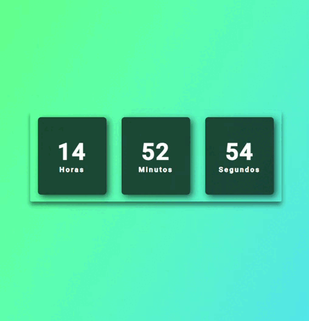
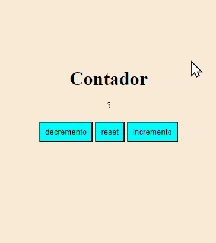
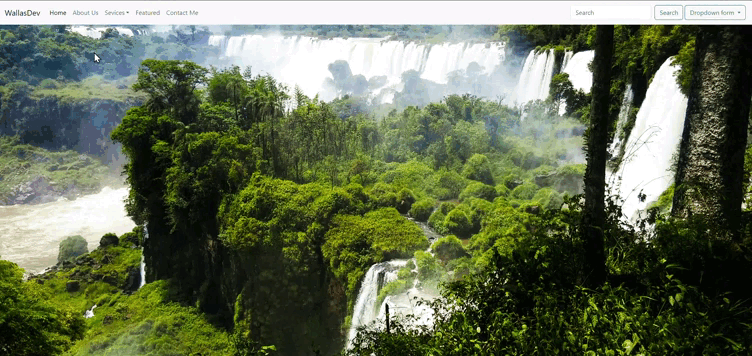
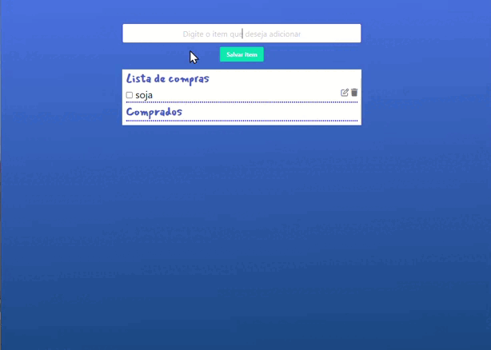
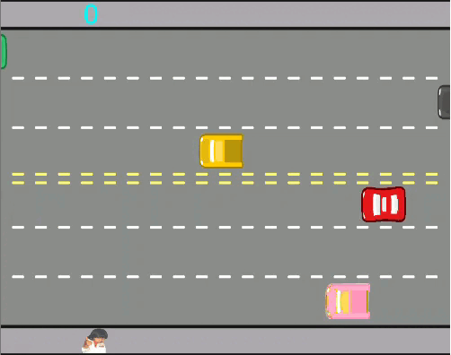
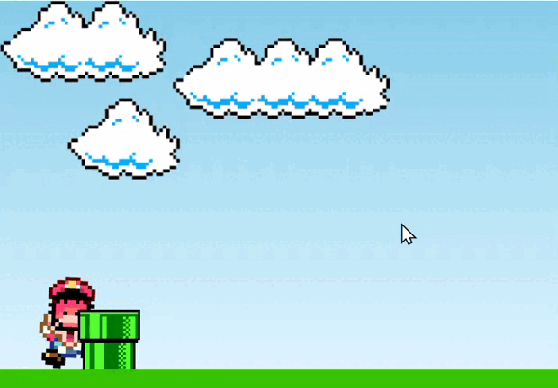

## Olá! Meu nome é Maycon wallas. 👋

## Tecnologias e Ferramentas

 
  
  
  
  
  

## Aprendendo

 
  
  
  
  
  

## Quero estudar

 
  
  
  
  
  
  

## Projetos javascript

           

 
  
   

